# PortalWissensdatenbank - ER-Diagramm

> 10 Entitaeten + 2 Join-Tabellen | Stand: 2026-03-29

```mermaid
---
title: PortalWissensdatenbank - Entity-Relationship-Diagramm
---
erDiagram

    %% ============================================================
    %% DOKUMENTENVERWALTUNG
    %% ============================================================

    wb_documents {
        VARCHAR36 id PK
        VARCHAR36 tenant_id "NOT NULL"
        VARCHAR500 title "NOT NULL"
        TEXT content "NOT NULL"
        VARCHAR2000 summary
        VARCHAR20 status "DRAFT/PUBLISHED/ARCHIVED"
        VARCHAR36 category_id FK
        VARCHAR36 created_by "NOT NULL"
        VARCHAR36 updated_by
        TIMESTAMP created_at
        TIMESTAMP updated_at
        INT version "DEFAULT 1"
        VARCHAR36 organization_unit_id
        BOOLEAN public_within_tenant "DEFAULT true"
        INT view_count "DEFAULT 0"
        DOUBLE rating_sum "DEFAULT 0"
        INT rating_count "DEFAULT 0"
    }

    wb_document_versions {
        VARCHAR36 id PK
        VARCHAR36 document_id FK "NOT NULL, CASCADE"
        INT version "NOT NULL"
        VARCHAR500 title "NOT NULL"
        TEXT content "NOT NULL"
        VARCHAR2000 summary
        VARCHAR36 changed_by "NOT NULL"
        TIMESTAMP changed_at
        VARCHAR500 change_note
    }

    wb_categories {
        VARCHAR36 id PK
        VARCHAR36 tenant_id "NOT NULL"
        VARCHAR200 name "NOT NULL, UNIQUE(tenant,name,parent)"
        TEXT description
        VARCHAR36 parent_id FK "self-ref"
        VARCHAR36 organization_unit_id
        INT order_index "DEFAULT 0"
        TIMESTAMP created_at
        TIMESTAMP updated_at
    }

    wb_tags {
        VARCHAR36 id PK
        VARCHAR36 tenant_id "NOT NULL"
        VARCHAR100 name "NOT NULL, UNIQUE(tenant,name)"
        TIMESTAMP created_at
    }

    wb_feedback {
        VARCHAR36 id PK
        VARCHAR36 document_id FK "NOT NULL, CASCADE"
        VARCHAR36 user_id "NOT NULL"
        VARCHAR36 tenant_id "NOT NULL"
        INT rating "CHECK 1-5"
        TEXT comment
        TIMESTAMP created_at
    }

    wb_document_tags {
        VARCHAR36 document_id FK "CASCADE"
        VARCHAR36 tag_id FK "CASCADE"
    }

    wb_documents ||--o{ wb_document_versions : "Versionen"
    wb_documents ||--o{ wb_feedback : "Bewertungen"
    wb_documents }o--o| wb_categories : "Kategorie"
    wb_documents }o--o{ wb_tags : "wb_document_tags"
    wb_categories }o--o| wb_categories : "parent (Hierarchie)"

    %% ============================================================
    %% WISSENSVERWALTUNG (Knowledge Management)
    %% ============================================================

    wb_knowledge_items {
        BIGSERIAL id PK
        VARCHAR64 tenant_id "NOT NULL"
        VARCHAR500 title "NOT NULL"
        TEXT summary
        VARCHAR20 knowledge_type "SEG4/ARTICLE/GUIDELINE"
        VARCHAR20 binding_level "VERBINDLICH/EMPFEHLUNG/LEX_SPECIALIS/INFORMATIV"
        TEXT keywords
        TIMESTAMP valid_from
        TIMESTAMP valid_until
        VARCHAR500 source_reference
        TIMESTAMP created_at "NOT NULL"
        TIMESTAMP updated_at "NOT NULL"
        VARCHAR255 created_by
        VARCHAR255 updated_by
    }

    wb_knowledge_sub_articles {
        BIGSERIAL id PK
        BIGINT knowledge_item_id FK "NOT NULL, CASCADE"
        VARCHAR500 heading "NOT NULL"
        TEXT content
        INT order_index "NOT NULL"
    }

    wb_seg4_recommendations {
        BIGSERIAL id PK
        BIGINT knowledge_item_id FK "NOT NULL, CASCADE"
        VARCHAR50 recommendation_number
        VARCHAR1000 schlagworte
        DATE erstellt_am
        DATE aktualisiert_am
        TEXT problem_erlaeuterung
        TEXT empfehlung
        TEXT entscheidung
        TEXT zusatzhinweis
        BOOLEAN is_arbitration "DEFAULT false"
        TEXT original_text
    }

    wb_knowledge_item_tags {
        BIGINT knowledge_item_id FK "CASCADE"
        VARCHAR36 tag_id FK "CASCADE"
    }

    wb_knowledge_items ||--o{ wb_knowledge_sub_articles : "Unterartikel"
    wb_knowledge_items ||--o{ wb_seg4_recommendations : "SEG4-Empfehlungen"
    wb_knowledge_items }o--o{ wb_tags : "wb_knowledge_item_tags"

    %% ============================================================
    %% KI-EMPFEHLUNGEN & AUDIT
    %% ============================================================

    wb_document_suggestions {
        BIGSERIAL id PK
        VARCHAR64 tenant_id "NOT NULL"
        VARCHAR255 user_id "NOT NULL"
        VARCHAR500 file_name "NOT NULL"
        VARCHAR255 file_content_type
        BYTEA file_data
        TEXT extracted_text
        VARCHAR32 status "PENDING/PROCESSING/COMPLETED/ERROR"
        TEXT error_message
        TEXT empfehlungen
        VARCHAR255 llm_model
        INT token_count
        TEXT quellen_json
        BIGINT audit_log_id FK
        VARCHAR255 model_config_id
        TIMESTAMP created_at "NOT NULL"
        TIMESTAMP updated_at
    }

    wb_suggestion_audit_log {
        BIGSERIAL id PK
        VARCHAR64 tenant_id "NOT NULL"
        VARCHAR255 user_id "NOT NULL"
        TEXT input_document_text
        VARCHAR500 used_knowledge_item_ids
        TEXT system_prompt
        TEXT user_prompt
        TEXT llm_response
        VARCHAR255 llm_model
        VARCHAR255 llm_config_id
        INT token_count
        TIMESTAMP created_at "NOT NULL"
    }

    wb_document_suggestions }o--o| wb_suggestion_audit_log : "Audit"
```

## Beziehungsuebersicht

| Von | Nach | Typ | Beschreibung |
|-----|------|-----|--------------|
| Document | DocumentVersion | 1:n | Versionsverlauf mit CASCADE DELETE |
| Document | Feedback | 1:n | Bewertungen (1 pro User pro Dokument) |
| Document | Category | n:1 | Kategoriezuordnung (optional) |
| Document | Tag | n:m | Tags via `wb_document_tags` |
| Category | Category | 1:n | Hierarchische Kategorien (self-ref) |
| KnowledgeItem | KnowledgeSubArticle | 1:n | Unterartikel mit Reihenfolge |
| KnowledgeItem | Seg4Recommendation | 1:n | SEG4-Kodierempfehlungen |
| KnowledgeItem | Tag | n:m | Tags via `wb_knowledge_item_tags` |
| DocumentSuggestion | SuggestionAuditLog | n:1 | LLM-Audit-Trail |

## Domaenenbereiche

| Bereich | Tabellen | Beschreibung |
|---------|----------|--------------|
| **Dokumentenverwaltung** | `wb_documents`, `wb_document_versions`, `wb_categories`, `wb_tags`, `wb_feedback`, `wb_document_tags` | CRUD mit Versionierung, Kategorien, Tags, Bewertungen |
| **Wissensverwaltung** | `wb_knowledge_items`, `wb_knowledge_sub_articles`, `wb_seg4_recommendations`, `wb_knowledge_item_tags` | SEG4-Empfehlungen, Artikel, Leitlinien |
| **KI-Empfehlungen** | `wb_document_suggestions`, `wb_suggestion_audit_log` | LLM-gestuetzte Kodierempfehlungen mit Audit-Trail |

## Indizes

| Tabelle | Index | Typ |
|---------|-------|-----|
| wb_documents | idx_wb_documents_tenant | B-Tree (tenant_id) |
| wb_documents | idx_wb_documents_status | B-Tree (tenant_id, status) |
| wb_documents | idx_wb_documents_fulltext | GIN (German Fulltext: title, content, summary) |
| wb_knowledge_items | idx_ki_tenant_type | B-Tree (tenant_id, knowledge_type) |
| wb_knowledge_items | idx_ki_fulltext | GIN (German Fulltext: title, summary, keywords) |
| wb_seg4_recommendations | idx_seg4_number | B-Tree (recommendation_number) |
| wb_document_suggestions | idx_ds_tenant_status | B-Tree (tenant_id, status) |
